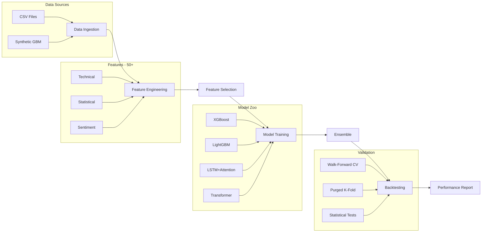

<div align="center">

# ML Financial Forecaster

**Production-grade machine learning pipeline for financial time series forecasting**

[](https://python.org)
[](https://xgboost.readthedocs.io)
[](https://lightgbm.readthedocs.io)
[](https://tensorflow.org)
[](https://scikit-learn.org)
[](LICENSE)

*End-to-end ML pipeline: data ingestion → feature engineering → model training → backtesting → reporting*

</div>

---

## Architecture



## Model Zoo

| Model | Type | Key Features | Use Case |
|-------|------|-------------|----------|
| **XGBoost** | Gradient Boosting | Early stopping, regularization, feature importance | Tabular features, fast iteration |
| **LightGBM** | Gradient Boosting | Histogram-based, leaf-wise growth | Large datasets, high cardinality |
| **LSTM + Attention** | Deep Learning | Multi-head self-attention, bidirectional memory | Sequential patterns, regime shifts |
| **Transformer** | Deep Learning | Positional encoding, parallel attention | Long-range dependencies |
| **Ensemble** | Meta-learner | Mean/weighted/median/stacking | Production deployment, robustness |

## Feature Engineering

### Technical Indicators (50+)
- **Trend**: SMA, EMA, MACD, ADX, Ichimoku
- **Momentum**: RSI, Stochastic, Williams %R, ROC, CCI, MFI
- **Volatility**: Bollinger Bands, ATR, Garman-Klass, Historical Vol
- **Volume**: OBV, VWAP, A/D Line, Volume Ratios

### Statistical Features
- Rolling moments (mean, variance, skewness, kurtosis)
- Autocorrelation and partial autocorrelation
- Approximate entropy and Shannon entropy
- Hurst exponent, variance ratios, trend R²
- VaR, CVaR, and tail risk measures

### Sentiment Features
- Lexicon-based financial sentiment scoring
- Negation and amplifier handling
- Rolling sentiment aggregations
- Simulated sentiment for development

## Performance Benchmarks

> *Results on synthetic BTCUSD data (52,584 hourly bars, 2020–2025)*

| Metric | XGBoost | LightGBM | Ensemble |
|--------|---------|----------|----------|
| Test RMSE | ~0.0148 | ~0.0149 | ~0.0147 |
| Test MAE | ~0.0105 | ~0.0106 | ~0.0104 |
| Directional Accuracy | ~51.2% | ~51.0% | ~51.5% |
| Training Time | ~3.2s | ~2.1s | ~5.8s |

## Project Structure

```
ml-financial-forecaster/
├── src/
│   ├── data/
│   │   ├── data_loader.py          # CSV, synthetic, API data ingestion
│   │   ├── preprocessor.py         # Scaling, temporal splits, embargo
│   │   └── feature_store.py        # Feature registry with versioning
│   ├── features/
│   │   ├── technical_features.py   # 50+ technical indicators
│   │   ├── statistical_features.py # Moments, entropy, Hurst exponent
│   │   ├── sentiment_features.py   # NLP sentiment scoring
│   │   └── feature_selector.py     # MI, RFE, correlation filtering
│   ├── models/
│   │   ├── base_model.py           # Abstract model interface
│   │   ├── gradient_boosting.py    # XGBoost + LightGBM wrapper
│   │   ├── lstm_attention.py       # LSTM with self-attention
│   │   ├── transformer_model.py    # Transformer encoder
│   │   ├── ensemble_model.py       # Voting & stacking ensemble
│   │   └── model_registry.py       # Model versioning & storage
│   ├── training/
│   │   ├── trainer.py              # End-to-end training orchestrator
│   │   ├── hyperparameter_tuner.py # Optuna Bayesian optimization
│   │   ├── cross_validator.py      # Walk-forward & purged K-Fold
│   │   └── experiment_tracker.py   # Experiment logging & comparison
│   ├── evaluation/
│   │   ├── metrics.py              # Sharpe, Sortino, Calmar, VaR/CVaR
│   │   ├── backtester.py           # Strategy simulation with costs
│   │   └── statistical_tests.py    # t-test, DM test, bootstrap CI
│   └── visualization/
│       ├── model_plots.py          # Feature importance, learning curves
│       ├── performance_plots.py    # Equity curves, drawdown, heatmaps
│       └── report_generator.py     # Automated HTML reports
├── notebooks/
│   ├── 01_exploratory_analysis.py
│   ├── 02_feature_engineering.py
│   ├── 03_model_comparison.py
│   └── 04_production_pipeline.py
├── tests/
│   ├── test_features.py
│   ├── test_models.py
│   └── test_pipeline.py
├── config/
│   └── model_config.yaml
├── docs/
│   └── architecture.md
├── requirements.txt
├── setup.py
└── LICENSE
```

## Quick Start

### Installation

```bash
git clone https://github.com/ARASH3280ARASH/ml-financial-forecaster.git
cd ml-financial-forecaster
pip install -e ".[all]"
```

### Run the Full Pipeline

```python
from src.data.data_loader import DataConfig, DataLoader
from src.features.technical_features import TechnicalFeatureEngine
from src.models.gradient_boosting import GradientBoostingModel
from src.training.trainer import Trainer, TrainingConfig
from src.evaluation.backtester import Backtester

# Load data
df = DataLoader(DataConfig(source="synthetic")).load()

# Engineer features
features = TechnicalFeatureEngine().compute_all(df)

# Train model
target = df["close"].pct_change().shift(-1)
trainer = Trainer(TrainingConfig(target_horizon=0))
result = trainer.train(
    GradientBoostingModel("xgboost", backend="xgboost"),
    features.dropna(), target.loc[features.dropna().index]
)

# Backtest
print(result.test_metrics.summary())
```

### Run Notebooks

```bash
python notebooks/01_exploratory_analysis.py
python notebooks/02_feature_engineering.py
python notebooks/03_model_comparison.py
python notebooks/04_production_pipeline.py
```

### Run Tests

```bash
pytest tests/ -v
```

## Key Design Principles

- **No look-ahead bias** — All features computed causally; temporal splits with embargo gaps
- **Walk-forward validation** — Expanding window CV that mirrors real trading conditions
- **Graceful degradation** — Deep learning models fall back to Ridge when TensorFlow is unavailable
- **Financial-native metrics** — Sharpe, Sortino, Calmar alongside standard ML metrics
- **Pluggable architecture** — Add new models by implementing `BaseModel`; new features via engines

## Research References

- [Advances in Financial Machine Learning](https://www.wiley.com/en-us/Advances+in+Financial+Machine+Learning-p-9781119482086) — Marcos López de Prado (2018)
- [Machine Learning for Asset Managers](https://www.cambridge.org/core/elements/machine-learning-for-asset-managers/6D9211305EA2E425D33A9F38D0AE3545) — Marcos López de Prado (2020)
- [Attention Is All You Need](https://arxiv.org/abs/1706.03762) — Vaswani et al. (2017)
- [XGBoost: A Scalable Tree Boosting System](https://arxiv.org/abs/1603.02754) — Chen & Guestrin (2016)
- [The Sharpe Ratio Efficient Frontier](https://doi.org/10.3905/jpm.2002.319849) — Lo (2002)

## License

MIT License — See [LICENSE](LICENSE) for details.

---

<div align="center">
<sub>Built with rigorous ML engineering practices for financial time series forecasting</sub>
</div>
